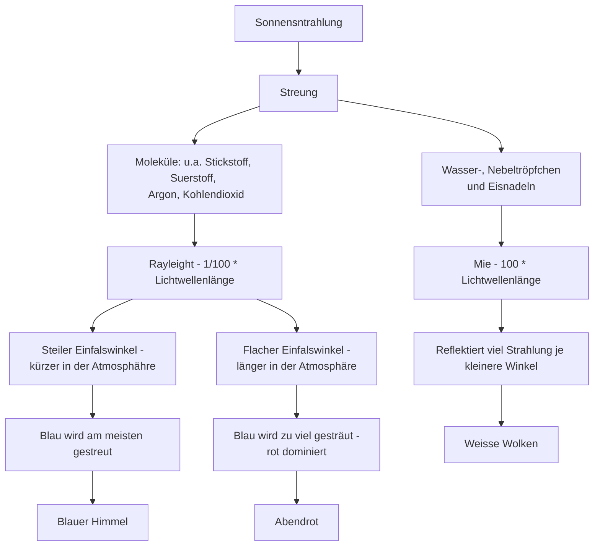

# Sonnenstrahlung

## Legende

- Die `Streung` ist die Verränderung der der Ausbreitungsrichtung von Strahlung, wenn diese auf Streukörper trifft. 

- Bei der `Rayleight-Strung` ist die Winkelabhängigkeit sehr klein, jedoch kürzere Wellenlänge werden eher gestreut.

- Bei der `Mie-Strahlung` wird keine Wellenlänge bevorzugt.
