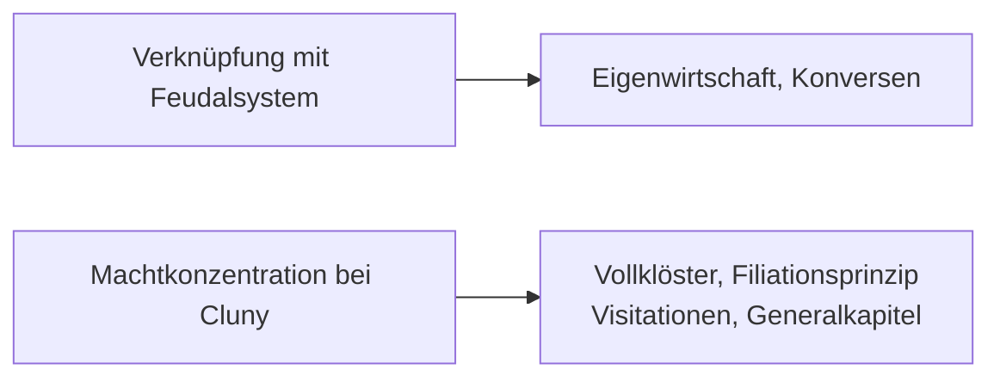

## Lösungen der Zisterzienser

- Die Zistenzienser bestimmen, sie wollen mehr Arbeiten anstatt externe Bauern anstellen

- Wel Mönche aber immer noch viel beten mussten, deswegen wurden Laienbrüder (Konversen) kreiert.
  
  - Sie durften nicht heiraten, wie die Mönche, aber sie waren *schlechter* als die Mönche
    
    - Sie lebten seperat
    
    - Sie hatten eine sperate Kirche
    
    - Dies erzwang eine Klassengeselschaft

## Organisation der Orden

- Die `Benediktiner` gründene eigene Kloster, wobei jedes einen eigenen Abt hat und komplett unabhängig sind

- Die `Cluniazenser` gründen ebenfalls neue Klöster, wobei der Grossabt in Cluny lebt, aber jedes Tochterklost nur noch Prioren hat. Dies hat aber nicht funktioniert, weil der Grossabt zu viel macht hatte

- Die Antwort der `Zisterzienser` auf die älteren 2 Orden war das Filliationsystem. Dabei darf jedes Kloster Tochterklöster gründen, welche ebenfalls Tochterklöster gründen dürfen, wobei jedes Kloster ein Vollkloster ist und einen eigenen Abt hat.
  
  - Jedes Jahr muss das Mutterkloster duch `Visitationen` kontrolieren und das Mutterkloster wird durch alle Tochterklöster gleichzeitig kontroliert
  
  - Ein mal im Jahr mussten sich die Äbte aller Kloster sich auf einer Generakapitel in Cîteaux treffen. Dort wird ebenfalls über die Enstehung neuer Klöster diskutiert. Dies ist etwas spezielles im Mittelalter, weil sie als einzige Komunition hatten damals und Erfindungen verbreiten konnten und wurden deswegen wirtschaftlich sehr erfolgreich.

- Das Kloster Wettingen unterliegt dem Kloster Salem und hat keine Tochterklöster

## Kapitelsaal

- Der Kapitelsaal ist Typisch für die Zisterzienser

- Dort wurde die Regeln der Mönche vorgelesen

- Wenn man gegen eine Regeln verbrochen hat oder jemand gesehen hat eine Regeln verstossen muss man diese beichten. Wenn man verstossen hat mussten man Konsequenzen akzeptieren, es gab sogar Gefängnisse in Zisterzienser Kloster. Die Mönche sahen, dies aber als etwas gutes an, weil dies ein Schutz vor Verwältlichung ist.
